Self-Driving Car Engineer Nanodegree Programm
=============================================


## Project – Capstone

**Team**:


| Name                           | github link | email                |
|--------------------------------|-------------|----------------------|
| Derrick Choo (lead)            | https://github.com/dalacan            | dalacan@gmail.com  |
| Chidhanandh Krishnaraj         |              | chidhukrishraj@gmail.com            |
| Libin Jia                      |               | jlbmtu@gmail.com   |
| Michael Zill                   |  https://github.com/taunusflieger            | michael.zill@accenture.com |
| Siqi Ying                      |           | siqiying1117@gmail.com    |


This document provides brief description of how the Capstone project was
completed with different section explained in detail and what steps were
followed.

### Abstract

In Automobile Industry, the expectation towards the driver assistance
and driver safety arouse the need of autonomously driving vehicles which
could have a near-zero accident rate, keeping the safety of the driver
and environment and maintaining the standards of the Automobile
industry. This project is divided into different section to attain the
main goal which is to make the Car drive by itself in the simulator and
in the real world with real time environment (Carla) considering
obstacles and traffic lights.

### Goal

To make the Ego car drive by itself in the traffic situations and
following the right trajectory to reach the goal point in the Simulator
and in the real world (Carla).

### Action

We will be developing ROS nodes to implement core functionality of the
autonomous vehicle system, including traffic light detection, control,
and waypoint following. 
This will be tested using the [Udacity simulator](https://github.com/udacity/CarND-Capstone/releases) 
and when verified, the project can be submitted to be run on Carla.

The project is distributed into four phases:

Phase 1: Waypoint updater (Partial)

Phase 2: Drive by Wire (DBW)

Phase 3: Traffic Light Detection

Phase 4: Waypoint updater (full)

The following is a system architecture diagram showing the ROS nodes and
topics used in the project.

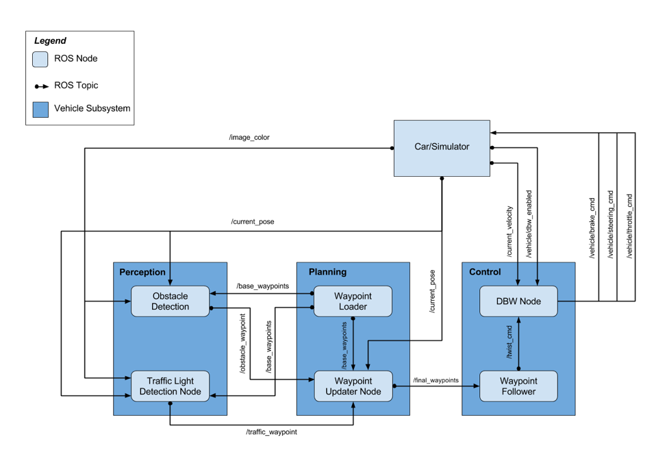

## Phase 1: Waypoint Updater (Partial)

### Description

The waypoint updater node will publish the final waypoints which
provides the trajectory for the ego car to move around.

Inputs:

```/base_waypoints```: Published by ```Waypoint_loader```, which is the static
waypoints which are the list of all the waypoints from the track.
Waypoints as provided by a static .csv file.

```/obstacle_waypoints```: Published by the Obstacle detection module.

```/traffic_waypoint```: Published by Traffic Light Detection Node which
published the waypoints to the traffic red light.

```/current_pose```: Current position published by the Car or the
simulator.
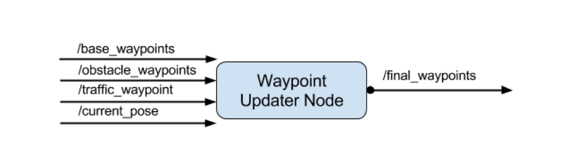

Output:

```/final_waypoints```

The final waypoints is published which provides the fixed number of
waypoints ahead of the vehicle.

The total number of waypoints ahead of the vehicle that should be
included in the ```/final_waypoints``` list is provided by the ```LOOKAHEAD_WPS```
(200 in this case) variable in ```waypoint_updater.py```.

## Phase 2: Drive by Wire (DBW)

### Description

Drive by wire (DBW) system will control the vehicle through controlling
throttle, braking, and steering. The DBW node logic accepts linear and
angular velocity by subscribing to ```twist_cmd``` and publish the throttle,
brake, and steering commands. The DBW node can be disabled and the
driver can control it.

### Inputs and outputs

This diagram illustrates the inputs and outputs for DBW node:

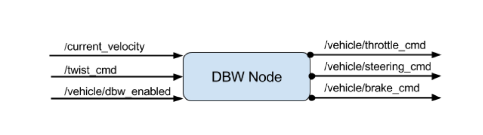

The inputs are:

```/current_velocity```: published by simulator and used by the DBW node to
determine the linear velocity and provide it to controller.

```/twist_cmd```: Waypoint\_follower node publishes it and subscribed by DBW
node to publish throttle, steering and brake commands.

```/vehicledbw_enable```: pusblished by simulator. DBW will determine whether
or not to publish throttle, steering, and brake information to
respective topics.

The outputs from DBW node are throttle, steering, and brake commands
published to ```throttle_cmd```, ```steering_cmd```, and ```brake_cmd``` respectively.

### Implementation

The ```dbw_node.py``` logic subscribes to the following ros topics:
 - `/vehicle/dbw_enabled` - Indicates whether drive by wire is enabled.
 - `/twist_cmd` - Provides the target linear and angular velocity based on the current 
 position and calculated trajectory.
 - `current_velocity` - Provides the current linear and angular velocity of the vehicle.
 
The information from the subscribed ros topics are used to calculate the required throttle, 
braking and steering angle of the car.

In addition to the ros topic information, the following information about the vehicle's dynamics 
are also used:
- vehicle mass
- wheel radius
- wheel base
- steering ratio
- maximum lateral acceleration
- maximum steering angle

Prior to using the measured linear and angular velocity to calculate the required throttle/braking/steering,
these velocity are pass through a low pass filter to filter out large fluctuation in measured velocities.

For the calculation of the throttle and braking we have elected to use a PID controller (`PID.py`). As the 
drive by wire can be temporarily disabled, a check for the `dbw_enabled` status is applied to reset the
PID coefficient so that the PID does not unnecessarily accumulate throttle integrals values. It also 
returns zero values for the throttle, braking and steering.

For the calculation of the steering, we have elected to use the provided Yaw controller (`yaw_controller.py`). 
In addition to using the yaw controller, smoothing is applied to the steering to keep the steering to the previous
steering value if the difference in current angular velocity and target angular velocity is less than 0.02.

For the calculation of the braking, if the target velocity is 0 and current velocity is less than 0.1, 
we apply the maximum brake torque of 700nM which is required to hold the vehicle in place. If not, if the 
throttle is less than 0.1 and different in target velocity is less than the current linear velocity, braking is set
relative to the velocity difference or maximum deceleration limit (whichever is greater). Braking force is calculated 
using the following equation:
```
braking force = velocity error * vehicle mass * wheel radius
```

Once the throttle, braking and steering has been computed, these values are published to their respective 
 ros topics
 - ```/vehicle/throttle_cmd```
 - ```/vehicle/braking_cmd```
 - ```/vehicle/steering_cmd```

The Controller logics within the ```twist_controller.py``` employs the ```PID.py```
to give a control on throttle command. The steering commands are
calculated through ```yaw_controller.py```. Both throttle and steering
commands are smoothed by a low pass filter from ```lowpass.py```.


## Phase 3: Traffic Light Detection

The Perception subsystem here senses the surrounding world for traffic
lights (in this project, obstacles are not detected), and publishes
useful messages to other subsystems. The traffic light detection node is
a core element of the solution as it informs about the presence and
state of traffic lights based on the images it receives from the camera.
This node subscribes to the data from the ```/image_color```, ```/current_pose```,
and ```/base_waypoints``` topics, and publishes the stop line to the nearest
red traffic light to the topic ```/traffic_waypoint```. The input messages
are the car's current position (from ```/current_pose``` topic), camera
images (from ```/image_color```), and a complete list of waypoints (from
```/base_waypoints```), while the output of the detection and classification
node is the state of the traffic light, and the index of the closest
stop line (-1 if not exists)(publishes to ```/traffic_waypoint```). The
module consists of two parts:

### Traffic light classifier
The traffic light classifier uses a TensorFlow based CNN
(```ssd_inception_v2_coco```) for object detection. The model has been
trained with a udacity provided data set. Given that the real-world
scenario and the simulator are quite different, we created to
different trained models – one for each scenario.

A large amount of effort went into labeling and augmenting the
training data which is based on the provided ros-bag file for the
real-world scenario and simulator images we saved from driving on
the simulator track.\
    
The end-to-end steps to training the model are:
1. Data preparation
2. Data labelling
3. Data augmentation
4. Training
5. Testing
    
#### Data preparation
To prepare the data for training the simulation model
1. We launch both the ros application `roslaunch launch/styx.launch` and the simulator.
2. Once the simulator is connected to the ros application, next we start to record 
the camera stream from the simulator car by running `rosbag record /image_color` 
3. In the simulator, check the 'Camera' checkbox and drive around the track to 
capture the traffic lights in their different states and from varying distances
4. To save the recording, close the rosbag recording session by pressing `Ctrl+C`
5. To extract the images from the rosbag file, we developed a ros image extraction script: [export.launch](./scripts/extract_images/export.launch). 
    1. To use the script in a terminal, run `roscore`
    2. In a second terminal, run `roslaunch export.launch bagfile:=/path/to/bagfile.bag topic:=image_color`
    3. The images will be extracted to the `/home/.ros/` directory
    
To prepare the data for training the parking lot (real world) model:
1. We downloaded the provided camera images from the provided [training bag file](https://s3-us-west-1.amazonaws.com/udacity-selfdrivingcar/traffic_light_bag_file.zip)
2. Next we extract the images out of the bag file, by using our ros image extraction script (refer above for instructions).
    

#### Data labelling
To label the data we used the [Labellmg](https://github.com/tzutalin/labelImg) tool.
    
#### Data augmentation
For the real world model, we analyzed the provided images and most of the images are in ideal driving conditions. 
However, in order to develop a most robust traffic light classification system, we decided to consider external 
factors that may impact the traffic light classification inference. Once such factor was the weather condition. 
Thus we developed an [image augmentation library](./scripts/image_augmentation) to create augmentations of the 
provided image to simulate various weather events.
    
The augmentation library caters for following weather conditions:
- Sunny day - increasing the brightness of the image
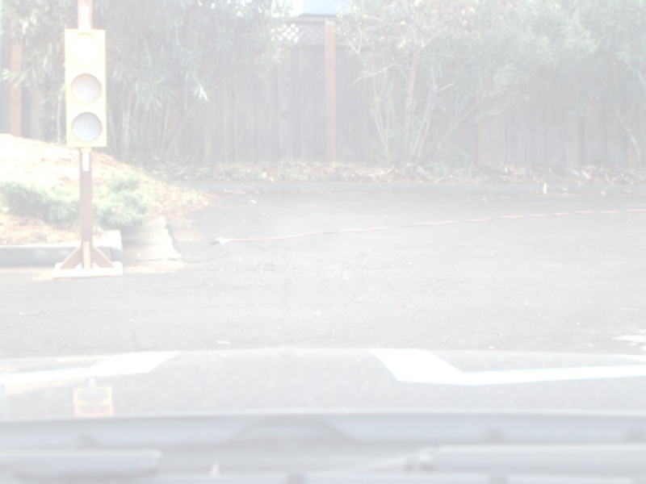
- Overcast day - decreasing the brightness of the image
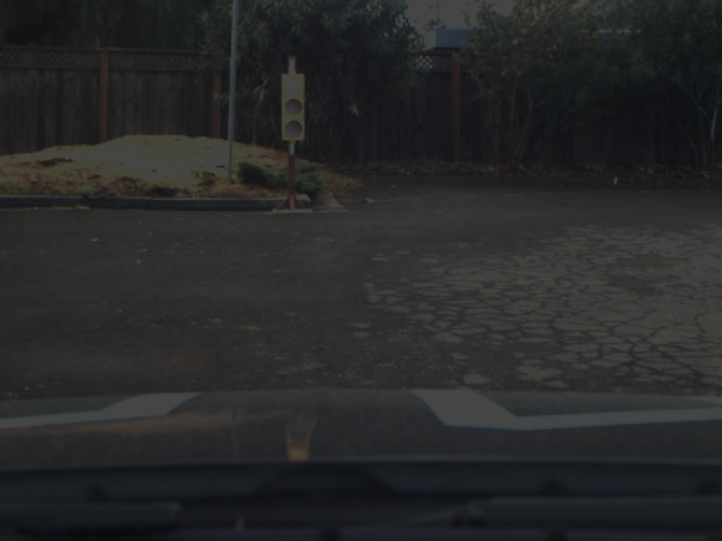
- Raining day - Adding rain effects to the image
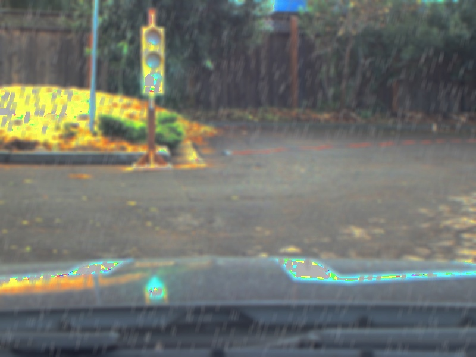
- Foggy day - Adding fog effects to the image
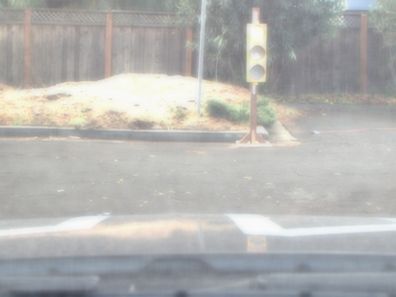
- Rain and fog - Combining rain and fog effects to the image
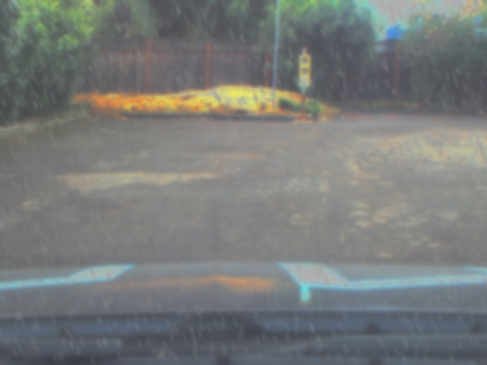
    
#### Training the model
To train the model, we used a pre-trained model. In our exploration, we trained the following models with
our traffic light images:
- ssd_mobilenet_v2_coco
- ssd_inception_v2_coco
- faster_rcnn_inception_v2_coco
- faster_rcnn_resnet101_coco
    
We also explored training the model using the [Bosch traffic dataset](https://hci.iwr.uni-heidelberg.de/node/6132). 
However, in our testing, we found that using the scenario specific dataset (simulator and parking lot) yield a much
significantly more accurate traffic light detection and classification.
    
To train the model we
1. Consolidate the label data into a single csv file
2. Generate the required tensorflow records for both training and validation with a 70%/30% data split. 
**Important:** When splitting the data, it is important that the augmented data is only included in the training 
data as we only want to validate against real world images. Ideally we would have a set of actual images that 
covers various weather conditions.
3. Download the required pre-train model from [Tensorflow detection model zoo] (https://github.com/tensorflow/models/blob/master/research/object_detection/g3doc/detection_model_zoo.md)
4. Configure the pipeline.config
5. Perform the training:
    1. Locally - refer to instructions here: https://github.com/tensorflow/models/blob/master/research/object_detection/g3doc/running_locally.md
    2. On Google Cloud - refer to instructions here: https://github.com/tensorflow/models/blob/master/research/object_detection/g3doc/running_on_cloud.md
6. Once the training is completed, you will need to freeze the model. **Important:** When freezing the model, it is 
important to freeze the model using Tensorflow 1.3 which the ros application (and carla) is setup to use.
       
#### Testing
To test our models, we used a jupyter notebook to test and explore the speed and accuracy of the models.
The notebooks can be found here:
- [Simulator](https://github.com/dalacan/traffic-light-classification/blob/master/Traffic%20Light%20Detection%20-%20Simulator.ipynb)
- [Parking lot (Real world)](https://github.com/dalacan/traffic-light-classification/blob/master/Traffic%20Light%20Detection%20-%20Real%20World.ipynb)
    
Using the notebook, we experimented with different CNN models to find a good balance between inference speed and accuracy.

    | Model                          | Inference speed ms   | Accuracy %  |
    |--------------------------------|----------------------|-------------|
    | ssd_mobilenet_v2_coco          | 19.9                 | 87.8        |
    | ssd_inception_v2_coco          | 27.8                 | 93.9        |
    | faster_rcnn_inception_v2_coco  | 79.7                 | 97.5        |
    | faster_rcnn_resnet101_coco     | 201                  | 97.5        |

It turned out that ```ssd_inception_v2_coco``` provides a good balance
between speed and accuracy. The following images show some samples of
test data which we used to verify the trained model.

The following images depict on the left side the inferred image and on the right side the ground truth image.

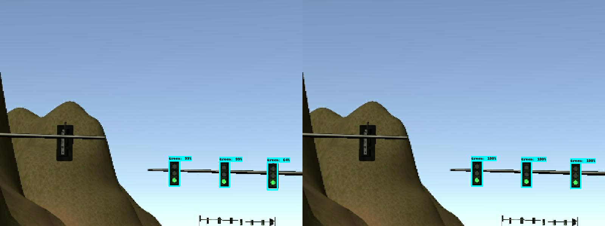
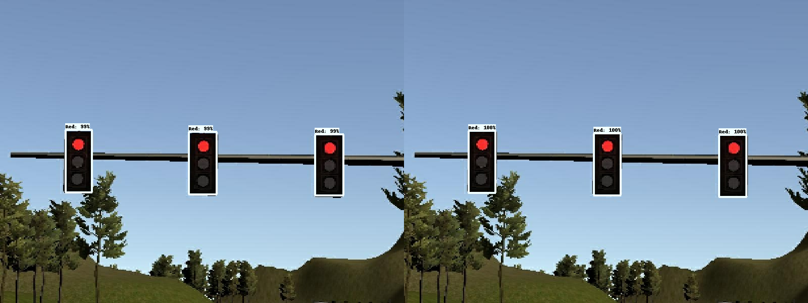

Simulator test samples:

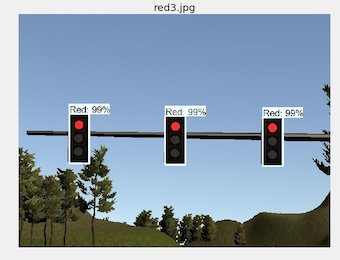
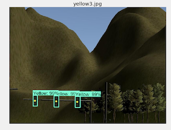

Real-world parking lot test samples:
    
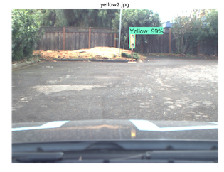
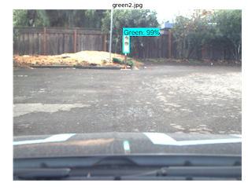

#### Implementation
The implementation of the traffic light classifier in done in the ```tl_classifier.py``` file. The classifier is 
designed to load the respective frozen graph based on the running configuration (simulator/parking lot) of the ros application.

The ```get_light_state()``` function determines the color of
the traffic light (ID of traffic light color, UNKNOWN=4, GREEN=2,
YELLOW=1, RED=0). The traffic light state detection and
classification is implemented in the ```TLClassifier::get_classification(image)``` function. 

### Traffic light detection
The traffic light detection module implements the traffic light classifier get the color of the traffic light
from the image provided by subscribed `image_color` ros topic . 

The ```process_traffic_lights()``` finds the closest visible traffic light based on the current position of the 
vehicle. 

Additionally, in order to avoid the sudden velocity change, and smooth the vehicle
behaviour (i.e. the classifier returning a red followed by an unknown state), we implemented a traffic light 
state threshold function. The function
- Records the number of consecutive same inferred traffic light states (i.e. 3 red lights inferred)
- If the number is greater than the threshold ```STATE_COUNT_THRESHOLD```（configured default: 3), the inferred state is used.
Otherwise the previous stable state is used. 

Finally, once the state has been identified, we publish the waypoint index of the closest red light's stop line if
the state is a red traffic light. This is published to the ```/traffic_waypoint``` ros topic.

## Phase 4: Waypoint Updater (Full)

### Description:

The Waypoint Updater (full) is the extension of the phase 1 Waypoint
updater, which publishes the final waypoints based on traffic light
detections or obstacle detections. The final waypoints published by this
node considers the calculation of the velocity which increases and
decreases on the traffic signal situations. The velocity will be reduced
when the traffic signal changes to RED and the velocity will increase
when the traffic signal changes to GREEN.

The inputs and outputs are already described in the Phase 1:
Waypoint_updater (Partial) section.

### Implementation:

The target velocity is set for the waypoints leading up to the red
traffic lights to bring the vehicle to a smooth stop.

The velocity is calculated based on the following formula. And in the
graph, we can see how the velocity is gradually decreasing instead of a
linear reduction, taking into account the max deceleration and the
stopping distance. The max deceleration is set to 0.5 m/s\^2 and
stopping distance is calculated based on the closest id of the red
traffic light.

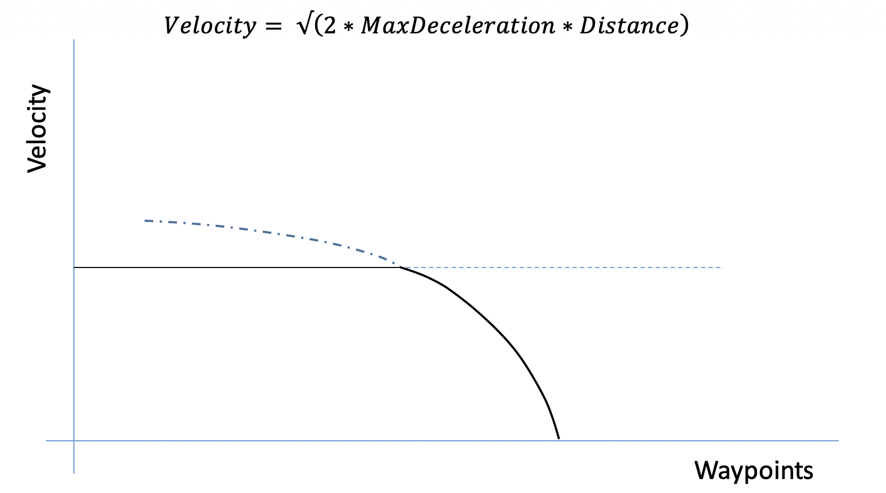

This way the Waypoint\_updater publishes the final waypoints considering
the target velocity of the car to the waypoint follower, which again is
sent to the DBW node which controls the braking and accelerating the
car.


## Conclusion

Although we manage to successfully test the implementation with the simulator, we did encounter several roadblock in 
our testing.
1. When running the simulator in the udacity workspace with the camera on, at times, the vehicle position was 
not being updated quick enough for the vehicle to provide an accurate drive by wire output to steer 
the vehicle correctly. To overcome this issue, we had to tweak the publishing rate of the waypoint updater
and drive by wire.
    - In the udacity workspace, we set these publication rates were set to 2Hz. 
    - On lower spec computers, our publication rates were between 10-30Hz
    - Running on a high spec machine allowed us to set the waypoint updater publication to 30Hz 
    and drive by wire to 50hz
2. Additionally to reduce the workload on machine, we implement the traffic light inference to run on every fifth image when running
in simulator mode.

## Setup Instructions

This is the project repo for the final project of the Udacity Self-Driving Car Nanodegree: Programming a Real Self-Driving Car. For more information about the project, see the project introduction [here](https://classroom.udacity.com/nanodegrees/nd013/parts/6047fe34-d93c-4f50-8336-b70ef10cb4b2/modules/e1a23b06-329a-4684-a717-ad476f0d8dff/lessons/462c933d-9f24-42d3-8bdc-a08a5fc866e4/concepts/5ab4b122-83e6-436d-850f-9f4d26627fd9).

Please use **one** of the two installation options, either native **or** docker installation.

### Native Installation

* Be sure that your workstation is running Ubuntu 16.04 Xenial Xerus or Ubuntu 14.04 Trusty Tahir. [Ubuntu downloads can be found here](https://www.ubuntu.com/download/desktop).
* If using a Virtual Machine to install Ubuntu, use the following configuration as minimum:
  * 2 CPU
  * 2 GB system memory
  * 25 GB of free hard drive space

  The Udacity provided virtual machine has ROS and Dataspeed DBW already installed, so you can skip the next two steps if you are using this.

* Follow these instructions to install ROS
  * [ROS Kinetic](http://wiki.ros.org/kinetic/Installation/Ubuntu) if you have Ubuntu 16.04.
  * [ROS Indigo](http://wiki.ros.org/indigo/Installation/Ubuntu) if you have Ubuntu 14.04.
* [Dataspeed DBW](https://bitbucket.org/DataspeedInc/dbw_mkz_ros)
  * Use this option to install the SDK on a workstation that already has ROS installed: [One Line SDK Install (binary)](https://bitbucket.org/DataspeedInc/dbw_mkz_ros/src/81e63fcc335d7b64139d7482017d6a97b405e250/ROS_SETUP.md?fileviewer=file-view-default)
* Download the [Udacity Simulator](https://github.com/udacity/CarND-Capstone/releases).

### Docker Installation
[Install Docker](https://docs.docker.com/engine/installation/)

Build the docker container
```bash
docker build . -t capstone
```

Run the docker file
```bash
docker run -p 4567:4567 -v $PWD:/capstone -v /tmp/log:/root/.ros/ --rm -it capstone
```

### Port Forwarding
To set up port forwarding, please refer to the [instructions from term 2](https://classroom.udacity.com/nanodegrees/nd013/parts/40f38239-66b6-46ec-ae68-03afd8a601c8/modules/0949fca6-b379-42af-a919-ee50aa304e6a/lessons/f758c44c-5e40-4e01-93b5-1a82aa4e044f/concepts/16cf4a78-4fc7-49e1-8621-3450ca938b77)

### Usage

1. Clone the project repository
```bash
git clone https://github.com/udacity/CarND-Capstone.git
```

2. Install python dependencies
```bash
cd CarND-Capstone
pip install -r requirements.txt
```
3. Make and run styx
```bash
cd ros
catkin_make
source devel/setup.sh
roslaunch launch/styx.launch
```
4. Run the simulator

### Real world testing
1. Download [training bag](https://s3-us-west-1.amazonaws.com/udacity-selfdrivingcar/traffic_light_bag_file.zip) that was recorded on the Udacity self-driving car.
2. Unzip the file
```bash
unzip traffic_light_bag_file.zip
```
3. Play the bag file
```bash
rosbag play -l traffic_light_bag_file/traffic_light_training.bag
```
4. Launch your project in site mode
```bash
cd CarND-Capstone/ros
roslaunch launch/site.launch
```
5. Confirm that traffic light detection works on real life images
